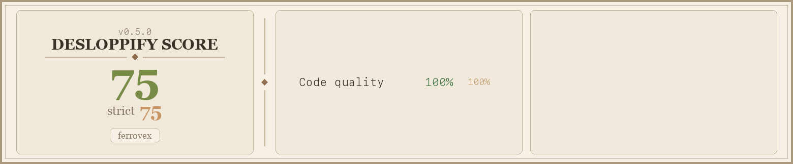

# ferrovex-embeddings

Semantic text embeddings and retrieval for Node.js/TypeScript, powered by Rust.

- Embeddings: [`embed_anything`](https://crates.io/crates/embed_anything)
- Vector persistence/search: [`lancedb`](https://crates.io/crates/lancedb)
- Bindings: N-API (`napi-rs`)

## Install

```bash
npm install ferrovex-embeddings
```

If you are developing this repository directly:

```bash
npm install
npm run build
```

## Quickstart

```ts
import { SemanticStore } from 'ferrovex-embeddings'

const store = new SemanticStore({
  dbPath: './data/lancedb', // optional; temp dir is used when omitted
  tableName: 'docs' // optional; default is "embeddings"
})

await store.insert('Rust + Node bindings', { source: 'intro', id: 1 })
await store.insert('LanceDB stores vectors on disk', { source: 'intro', id: 2 })

const v = await store.embed('Rust + Node bindings')
const vv = await store.embed(['first text', 'second text'])

const matches = await store.query('node native extensions', { limit: 5 })
console.log(v.length, vv.length, matches[0])
```

## API

### `new SemanticStore(options?)`

```ts
type StoreOptions = {
  dbPath?: string
  tableName?: string
  runtime?: 'hf' | 'onnx'
  modelArchitecture?: string
  modelId?: string
  revision?: string
  onnxModelId?: string
  onnxPathInRepo?: string
}
```

- `dbPath` omitted: uses a temp directory (ephemeral process-scoped store).
- `dbPath` set: persists data on disk at that path.

### `insert(text, metadata?) => Promise<void>`

- Embeds `text`.
- Inserts `{ text, metadata, vector }` into LanceDB.

### `embed(text) => Promise<number[]>`

- Returns one embedding vector for a single input string.

### `embed(texts: string[]) => Promise<number[][]>`
### `embedBatch(texts: string[]) => Promise<number[][]>`

- Returns one embedding vector per input string.
- `embed(string[])` and `embedBatch(string[])` are equivalent.

### `query(text, params?) => Promise<QueryResult[]>`

```ts
type QueryParams = {
  limit?: number
  filter?: string // Lance SQL predicate
}

type QueryResult = {
  text: string
  metadata?: Record<string, unknown>
  distance?: number
  score?: number
}
```

- Embeds `text`, performs nearest-neighbor search in LanceDB, returns rows.
- `distance` comes from LanceDB (`_distance`).
- `score` is derived as `1 / (1 + max(distance, 0))` for a simple bounded similarity signal.

## Runtime and acceleration

### Default runtime (`hf`)

- Uses HuggingFace model loading through `embed_anything`.
- Default model: `jinaai/jina-embeddings-v2-small-en`.

### ONNX runtime (`onnx`)

- Uses `Embedder::from_pretrained_onnx`.
- Requires `onnxModelId` (or `modelId` fallback).
- Optional `onnxPathInRepo`.

### macOS Metal

- macOS builds enable Metal by default.
- Disable Metal if needed (CI/sandbox fallback):

```bash
FERROVEX_DISABLE_METAL=1 npm run build
```

## Local development commands

```bash
# native build (release)
npm run build

# native build (debug)
npm run build:debug

# end-to-end smoke test (embed + insert + query)
npm run smoke

# rust compile check
cargo check
```

Smoke test env overrides:

- `FERROVEX_SMOKE_RUNTIME` (`hf` or `onnx`)
- `FERROVEX_SMOKE_MODEL_ID` (defaults to `sentence-transformers/paraphrase-MiniLM-L3-v2`)

## Packaging and release

This repository is set up for npm prebuilt binaries:

- Root package: `ferrovex-embeddings`
- Platform packages under `npm/*`:
  - `ferrovex-embeddings-linux-x64-gnu`
  - `ferrovex-embeddings-win32-x64-msvc`
  - `ferrovex-embeddings-darwin-x64`
  - `ferrovex-embeddings-darwin-arm64`

GitHub workflow: `.github/workflows/release.yml`

- Trigger: push tags matching `v*`
- Builds native artifacts per target
- Publishes platform packages + root package to npm

Required secrets/variables:

- npm Trusted Publishing (GitHub Actions OIDC) must be configured in npm for:
  - `ferrovex-embeddings`
  - `ferrovex-embeddings-linux-x64-gnu`
  - `ferrovex-embeddings-win32-x64-msvc`
  - `ferrovex-embeddings-darwin-x64`
  - `ferrovex-embeddings-darwin-arm64`
- Optional repo variable: `FERROVEX_DISABLE_METAL=1` (for CI fallback)

## Scorecard



## License

MIT
